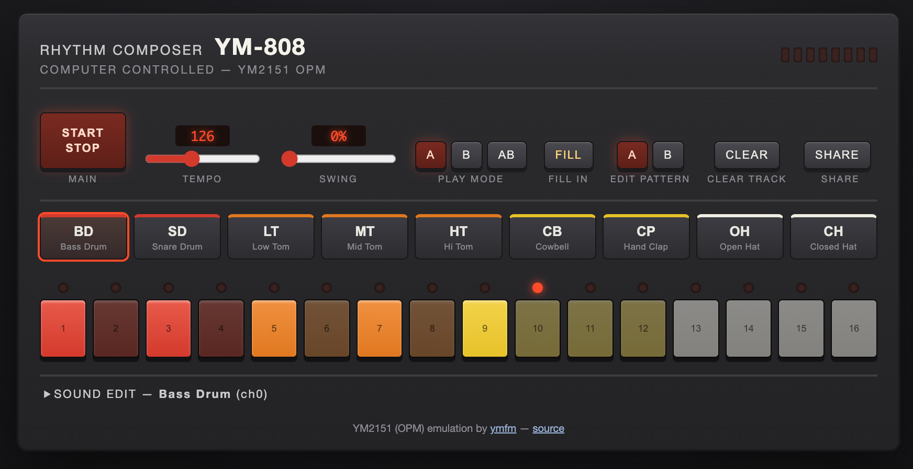

# 2151-808 — YM-808 Rhythm Composer

TR-808 スタイルの 16 ステップシーケンサーで、**YM2151 (OPM) の FM 音源エミュレーション**を鳴らすリズムマシン Web アプリ。

**▶ https://goroman.github.io/2151-808/**



## 特徴

- **本物の YM2151 コア**: [ymfm](https://github.com/aaronsgiles/ymfm) (Aaron Giles) を WebAssembly にビルドし、AudioWorklet 内でレジスタ書き込みベースで駆動。チップネイティブレート (3.579545MHz ÷ 64 ≈ 55.93kHz) で生成し、リサンプルして出力
- **9 インストゥルメント**: BD / SD / LT / MT / HT / CB / CP / OH / CH を YM2151 の 8 チャンネルに割り当て (OH/CH は ch7 のノイズを共有、チョーク動作あり)
- **サンプル精度のシーケンサー**: AudioWorklet 内のフレームカウンタで駆動。ピッチスイープ (キック/タム) はトリガー後の KC/KF レジスタ自動書き込みで実現
- 16 ステップ × アクセント、テンポ、スウィング、A/B パターン + AB 交互再生、FILL
- **SOUND EDIT**: 各音色の FM パラメータ (ALG/FB/MUL/TL/EG/DT/ノイズ周波数…) をリアルタイム編集
- パターン+音色を localStorage に自動保存、URL ハッシュで共有

## 開発

```bash
git clone --recursive https://github.com/GOROman/2151-808.git
cd 2151-808
npm install
npm run build:wasm   # 要 emscripten (brew install emscripten)
npm run dev
```

`public/ymfm.wasm` はコミット済みなので、emscripten なしでも `npm run dev` だけで動きます。

## ライセンス

- アプリ本体: MIT
- YM2151 エミュレーションコア: [ymfm](https://github.com/aaronsgiles/ymfm) (BSD-3-Clause)
